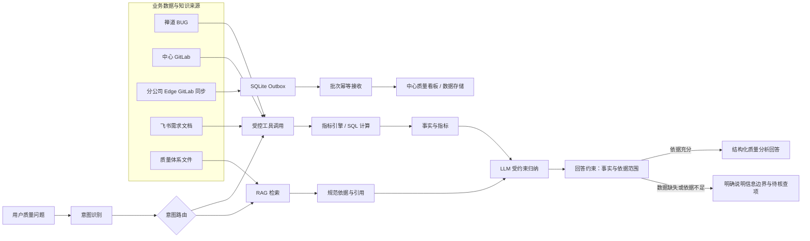
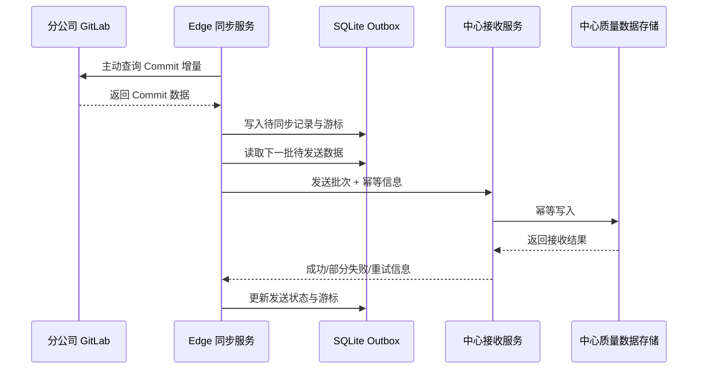

# 质量管理体系 Agent 项目卡

> **学习目标**：掌握这份项目的完整讲述方式。面试时不要只背模块名称，要能说明每个设计解决的业务问题、可靠性风险和工程约束。
> **事实边界**：本文以 `resume/个人简历2.0.pdf` 为事实来源。简历明确包含 LangGraph 主流程、ToolRegistry、指标引擎与 RAG 边界、LLM 需求变更标注落库，以及 Edge 主动同步链路；未列出的吞吐量、实时性、零丢失、高可用、人工确认流程和线上准确率不作为既有项目结果表达。

---

## 一、项目定位

### 一句话介绍

我参与构建了一个面向企业内部质量管理场景的 Agent，接入禅道 BUG、GitLab Commit、飞书需求文档和质量体系文件，帮助用户查询质量指标、分析缺陷问题，并在回答中保留数据和规范依据。

### 业务问题

企业质量信息通常分散在多个系统中：

- 禅道保存缺陷记录、严重等级、状态和历史变化。
- GitLab 保存提交和代码变更相关信息。
- 飞书保存需求文档和需求变更信息。
- 质量体系文件保存规范、流程和 checklist。

如果用户分别查询这些系统，再人工对照规范，效率较低；如果把所有内容直接交给 LLM，又容易出现统计错误、引用缺失和无依据结论。因此项目重点不是“让模型回答问题”，而是建立一条有边界的质量分析链路。

### 我的核心价值表达

> 我在项目中构建了“意图识别 → 受控工具调用 → 结果生成”的 LangGraph 主流程，设计 ToolRegistry，并划分结构化指标计算、质量体系 RAG 与 LLM 需求变更标注的职责边界；同时实现 Edge 主动同步，将分公司 GitLab Commit 安全接入中心质量看板。

---

## 二、总体架构

### 架构图口述版

> 用户问题首先经过意图识别和路由。对于缺陷等级、功能分布、激活情况等结构化问题，系统通过受控工具访问业务数据，再由指标引擎或 SQL 进行确定性计算；对于质量体系规范和 checklist，则通过 RAG 检索相关条款。两类结果分别作为事实和依据交给 LLM 做受约束的归纳。对于分公司 GitLab，中心系统不能主动访问内网，因此由 Edge 端主动获取数据，写入本地 SQLite Outbox，再按游标增量和批次幂等方式同步到中心质量看板。面试表达时，数据或依据不足不能被模型补写成确定事实，应明确说明信息边界和待核查项。

---

## 三、数据来源与职责边界

| 数据类型 | 示例 | 推荐处理方式 | 不应直接交给 LLM 的原因 |
| --- | --- | --- | --- |
| 结构化业务事实 | BUG 数量、严重等级分布、功能分布、激活数量 | 工具 + SQL/指标引擎 | 模型不擅长稳定统计，容易漏项、重复计算或产生幻觉数字 |
| 半结构化变更记录 | BUG 历史描述、需求变更说明 | LLM 标注 + 落库 + 原文保留 | 规则难以覆盖自然语言，但模型标注必须可复查，不能直接当成绝对事实 |
| 规范性知识 | 质量体系文件、checklist、流程规范 | RAG 检索 + 元数据/来源信息 | 需要给出原始依据和条款，不能只生成概括性结论 |
| 用户问题 | “某模块缺陷为什么增加？” | 意图识别 + 参数提取 | 需要判断查询指标、时间范围、模块和是否需要规范依据 |
| 外部系统数据 | 分公司 GitLab Commit | Edge 主动同步 + Outbox + 中心批量接收 | 中心网络边界不允许直接拉取，需要考虑断点、重复和数据隔离 |

### 责任边界的面试表达

> 这个系统里，我不会让 LLM 对所有数据承担同样的责任。可计算的事实交给确定性工具，规范性内容交给 RAG 提供依据，LLM 负责意图理解和受约束归纳。这样做的核心不是限制模型能力，而是让不同类型的信息由更适合的组件负责；信息不足时，也不能把推测包装成确定结论。

---

## 四、跨网络 GitLab 数据同步

### 1. 为什么需要 Edge 主动同步

中心系统不能主动访问分公司内网中的 GitLab，因此不能设计成“中心服务定时请求所有分公司 GitLab”。更合适的方式是：

1. 分公司 Edge 服务在内网侧主动访问本地 GitLab。
2. Edge 服务读取新增或变化的 Commit 数据。
3. 数据先写入本地 SQLite Outbox，形成待同步记录。
4. Edge 按游标定位增量数据，以批次发送到中心系统。
5. 中心系统按幂等键接收批次并写入中心质量数据存储。

### 2. 同步架构

### 2.1 当前代码中的关键实现细节

面试被追问实现细节时，可以按下面的真实代码回答：

- Edge 侧使用 SQLite 保存 `batches` 和 `sync_cursors`；批次状态包括 `pending`、`delivered`、`failed`、`blocked`。
- 每轮同步先处理历史 `pending` 批次，再按项目读取增量数据；默认首次回溯 30 天，增量查询使用 5 分钟重叠窗口，单批最多 100 条，并限制并发批次数。
- 批次成功投递后标记为 `delivered` 并推进项目游标；失败时保留为 `pending`，增加 `retry_count` 并记录 `last_error`，因此可以再次投递。
- 中心接口接收前校验 Edge Bearer Token 和 `payload_digest`；接收服务按 `(instance_id, idempotency_key)` 识别重复批次。
- 中心写入 Commit 时还通过 `(instance_id, project_id, commit_sha)` 的唯一约束做数据层防重，形成“批次级幂等 + Commit 级唯一约束”两层保护。

这些是当前代码能够确认的机制。代码注释提到指数退避，但当前核对到的同步服务中不能据此表述为“已经实现指数退避”。

### 3. SQLite Outbox 解决什么问题

Outbox 是 Edge 侧的本地待同步记录表。它主要解决：

- GitLab 数据已经被 Edge 读取，但中心网络暂时不可用时，数据不需要只停留在进程内存中。
- 服务重启后，可以根据持久化记录继续处理待同步数据。
- 发送成功与否有明确状态，便于重试、排查和审计。
- 读取数据和发送数据的过程解耦，避免中心短暂不可用阻塞内网采集。

不能直接声称 Outbox 已经实现“绝不丢失”。更准确的说法是：它提供本地持久化和可重试基础，实际可靠性仍取决于事务边界、磁盘空间、失败处理和中心端幂等设计。

### 4. 游标增量同步解决什么问题

当前实现按项目保存 `last_synced_before` 游标。首次同步没有游标时默认回溯 30 天，后续按游标读取增量，并额外保留 5 分钟重叠窗口，降低边界时间相同或延迟写入导致漏读的风险。单次批次最多 100 条。

需要注意：游标推进必须和数据落库、Outbox 写入或发送状态之间有明确关系。不能在数据尚未可靠保存时就盲目推进游标，否则可能跳过未成功记录。

### 5. 批次幂等接收解决什么问题

当前中心端的实现分两层：

1. 以 `(instance_id, idempotency_key)` 查询接收回执；同一批次重复到达时直接返回重复数量，不再次写入。
2. Commit 写入使用 `(instance_id, project_id, commit_sha)` 的唯一约束做数据层防重。

网络重试可能导致同一批数据被发送多次，因此中心端不能简单地“收到一次就插入一次”。一般处理方式是：

- 首次收到：写入数据并记录处理结果。
- 重复收到且内容一致：返回已处理结果，不重复写入。
- 同一标识内容不一致：进入冲突或人工排查，不静默覆盖。

这能解决“重复发送导致重复数据”的问题，但不能自动证明所有网络故障都不会造成数据问题。

### 6. 多实例数据隔离与 Docker 化交付

- **多实例数据隔离**：不同分公司或不同 Edge 实例的数据需要带有来源标识，在存储、查询和同步处理中保持隔离，避免一个实例的数据被错误归入另一个实例。
- **Docker 化交付**：将 Edge 服务及其运行依赖以容器方式交付，减少环境差异，便于在不同分公司部署；但 Docker 本身不等于安全隔离或高可用，还需要结合权限、网络、配置和数据卷管理。

中心接收接口还会校验实例是否存在且处于 active 状态；Edge 端通过实例编码和 Bearer Token 标识来源。这里的多实例隔离重点是实例标识贯穿接收回执、Commit 存储和唯一约束，而不是只依赖容器隔离。

### 同步链路的边界表达

> 简历能够确认的是 Edge 主动同步、SQLite Outbox、游标增量、批次幂等、多实例数据隔离和 Docker 化交付。面试时我不会把这些设计直接表述为已经验证了实时性、吞吐量、零丢失或高可用指标；如果需要量化结论，还需要补充压测和故障演练数据。

---

## 五、LangGraph 工作流

### 1. 面试中可展开的节点划分

> 简历明确的主流程是“意图识别 → 受控工具调用 → 结果生成”。下表用于回答技术追问，说明可以如何把主流程进一步拆分；其中结果校验、人工复核等属于可选的可靠性设计，不应在未核对代码前表述为既有节点。

| 节点 | 输入 | 输出 | 失败处理 |
| --- | --- | --- | --- |
| 意图识别 | 用户问题、会话上下文 | 意图类型、参数草案、是否需要规范依据 | 无法识别时请求澄清或进入通用兜底 |
| 参数校验 | 意图和参数草案 | 标准化指标、时间范围、模块等参数 | 缺少必填参数时不调用工具，返回澄清问题 |
| 工具选择 | 标准化意图 | 允许调用的工具列表 | 工具不存在或无权限时拒绝调用 |
| 受控工具调用 | 工具名、结构化参数 | 结构化业务结果 | 超时、权限失败、数据源失败时记录错误并降级 |
| 指标整理 | 工具结果 | 可供回答的事实对象 | 数据为空时标记数据不足，不填充猜测值 |
| RAG 检索 | 规范查询、过滤条件 | 条款、来源和相关性信息 | 无命中或相关性不足时标记依据不足 |
| 结果生成 | 事实、依据、用户问题 | 结构化回答草案 | 输出不符合 schema 或引用缺失时重新生成或降级 |
| 回答边界检查 | 回答草案、事实、依据 | 带来源的回答或信息不足说明 | 发现超出已有事实/依据的表述时删减、改写或提示待核查 |

### 2. LangGraph 状态建议

状态中至少需要能区分：

- 原始用户问题。
- 当前识别出的意图和标准化参数。
- 已调用的工具及其结果。
- 检索到的规范依据及来源。
- 当前节点和执行状态。
- 错误信息、信息不足原因和是否建议业务复核。
- 最终回答或无法确认结果。

状态设计的重点是让节点之间传递结构化信息，而不是把所有内容拼接成一段越来越长的自然语言上下文。

### 3. 为什么使用 LangGraph

> 这个项目不是一次 Prompt 调用，而是包含意图识别、参数校验、工具调用、检索、结果生成和异常分支的多步骤流程。LangGraph 可以把节点、状态和迁移关系显式化，便于加入条件分支、重试、日志记录，以及必要时的业务复核。相比在业务代码中手写大量嵌套调用，它更容易表达流程和维护状态；但它不是可靠性的自动保证，工具权限、数据校验和错误处理仍需要业务代码实现。

---

## 六、ToolRegistry 设计

### 工具定义至少包含

- 工具名称和用途描述。
- 输入参数 schema、类型和必填约束。
- 返回结果 schema。
- 数据来源和时间范围说明。
- 所需权限或允许调用的角色。
- 超时、重试和错误类型。
- 是否允许用于最终回答，还是只能作为中间分析工具。

### 受控调用流程

1. LLM 根据意图选择候选工具。
2. 系统检查工具是否存在、当前用户是否有权限。
3. 使用 Pydantic 或等价 schema 校验参数类型和范围。
4. 对时间范围、模块名、分页大小等参数做业务约束。
5. 工具在固定权限和数据范围内执行。
6. 返回结构化结果和来源信息，而不是任意自然语言。
7. 记录调用日志、耗时、成功/失败状态和错误原因。

### 为什么不能让 LLM 直接拼接 SQL

LLM 直接生成并执行 SQL 会带来注入、越权、全表扫描、字段误用和统计口径不一致等风险。将常用指标封装成受控工具，虽然灵活性降低，但更容易进行参数校验、权限控制、测试和审计。对于确实需要动态查询的场景，也应限制可访问表、字段、操作类型和查询成本。

---

## 七、需求变更标注与落库复用

### 为什么需要标注

BUG 历史描述和需求变更说明通常是自然语言，简单规则难以覆盖同义表达、上下文和隐含关系。LLM 可以辅助判断一条历史记录是否与需求变更相关，并给出结构化标注。

### 推荐处理链路

1. 读取原始缺陷记录及相关需求上下文。
2. 使用明确的标注定义和结构化输出 schema。
3. LLM 输出结构化标注结果和判断依据。
4. 当前代码中将结果写回缺陷记录：`is_req_change_caused` 使用三态表达“未判断 / 是 / 否”，`req_change_evidence` 保存 LLM 判断依据，便于内部追溯和后续复用。
5. 人工抽查、模型版本和提示词版本关联、评估集等属于进一步完善方向；除非能结合个人实际经历核对，不要表述为已经实现。
6. 后续分析复用已落库的标注结果，同时保留原始记录并允许纠正或重新标注。

### 重要边界

> LLM 的标注结果是可复用的分析特征，不应未经校验就当作绝对事实。原始记录必须保留，标注来源和版本必须可追溯，错误样本需要进入后续评估集。

---

## 八、典型业务回答

### 问题：某模块最近缺陷激增，系统应该怎么分析？

### 参考回答

> 我会先明确时间范围、模块和“激增”的比较基线，例如与上一周期或历史平均相比。然后通过结构化工具统计该模块不同严重等级、缺陷状态、来源和时间分布，并结合 GitLab Commit、需求变更标注和质量体系 checklist 检索相关依据。LLM 只负责把这些事实组织成分析摘要，并明确区分已确认事实、可能原因和待验证假设。如果缺少足够数据或质量体系依据，我会说明当前不能支持某项归因，以及需要补充什么信息，而不是直接归因。

### 这个回答体现的能力

- 先澄清口径，再计算指标。
- 事实和假设分开。
- 结构化数据由工具提供。
- 规范结论由 RAG 提供依据。
- 无证据时安全降级。

---

## 九、项目总结背诵版

> 这个项目让我形成的核心设计思想是：不要让 LLM 独立承担所有业务判断。质量管理中的结构化事实交给工具和指标引擎，质量规范交给 RAG 提供依据，LLM 负责意图理解和受约束归纳；对于分公司 GitLab 这类跨网络数据，则由 Edge 主动同步，通过 SQLite Outbox、游标增量和批次幂等接入中心。最终系统需要能说明答案依据，并在数据缺失、工具失败或证据不足时明确结论边界。这样 Agent 才不仅能演示，还具备进入企业流程的可控性基础。
