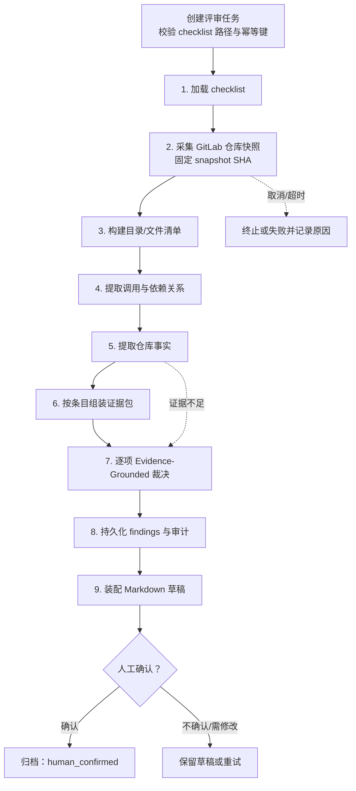
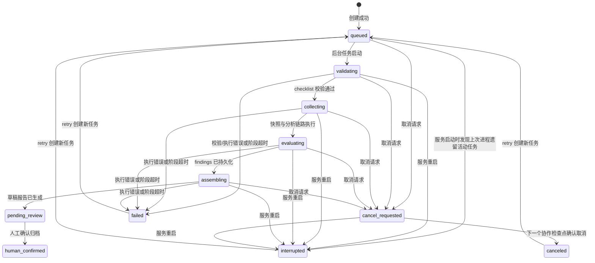

# 项目卡：功能开发成果评审 Agent

> **项目一句话**：面向 GitLab 代码仓库的只读、证据驱动 checklist 评审 Agent；它固定评审对象的仓库快照，生成可追溯的评审草稿，再由人工确认归档。

---

## 一、1 分钟口述答案

> 我参与开发了一个面向 GitLab 仓库的功能开发成果评审 Agent。它的目标不是让大模型凭感觉给代码打分，而是按照 checklist 对固定版本的代码生成可追溯的评审草稿。流程从加载 checklist 开始，对指定分支采集仓库快照并固定 SHA，再做目录清单、依赖关系和仓库事实提取；之后按 checklist 组装证据包，逐项让 LLM 在给定证据范围内裁决。每个结论都会关联 checklist 来源、文件路径、行号和快照 SHA。我们对模型返回的证据索引做校验：引用缺失、越界或不合法时，结论会保守降级为“证据不足或无法确认”，而不是编造。任务层还提供幂等创建、进度和心跳、取消、重试、服务重启中断标记与审计。安全上使用只读 GitLab Token，源码只在内存中处理，不落库；同时设置文件大小和并发限制。最终结果只是草稿，必须经人工确认后才归档。

## 二、为什么需要它

### 业务问题

- 人工按 checklist 评审仓库成本高，且不同评审人容易遗漏条目或难以回溯依据。
- 直接把仓库代码交给 LLM 容易出现“说得像对、但无法定位”的结论，难以作为工程协作依据。
- 默认分支会不断变化；如果结论不绑定提交版本，之后无法复盘“当时究竟审了什么”。

### 目标与非目标

| 目标 | 非目标 |
| --- | --- |
| 为每条 checklist 生成带定位信息的评审草稿 | 自动批准、自动合并或自动发布 |
| 让结论可复查到固定仓库快照 | 向 GitLab 写评论、MR、Issue 或修改源码 |
| 提供进度、取消、重试与审计 | 用模型替代人的最终工程责任 |
| 对信息不足显式降级 | 把“未找到证据”武断解释为“不符合” |

## 三、整体链路：9 个业务阶段



### 当前实现的准确说法

- `build_code_review_graph()` 中实际有 7 个图节点：第 1–7 阶段。
- 第 8–9 阶段由任务服务层在图执行返回后完成：保存 findings、生成叙述和 Markdown 草稿、写入报告元数据。
- “人工确认/归档”是 API 和任务状态机中的人工控制点，不是让 LangGraph 自动向下执行的节点。

### 为什么这样拆层

- **LangGraph**：专注受控分析步骤和状态传递。
- **ToolRegistry**：Agent 不能绕过工具直接访问 GitLab 或数据库；工具层集中做权限、输入、日志和异常边界控制。
- **任务服务层**：持有后台线程、数据库事务、状态迁移、持久化、报告文件与恢复策略。
- **人工确认**：将“模型输出”与“正式归档”隔离，保留业务责任。

## 四、Evidence-Grounded 裁决机制

### 1. 核心数据结构

每个 checklist 条目包含 `item_id`、名称、判定规则、风险/优先级、来源文件、来源 SHA 和来源行号。每条评审结论至少包含：

- `status`：`符合`、`不符合`、`证据不足或无法确认`、`不适用`。
- `reason`：针对该条目的结论原因。
- `checklist_basis` 与 checklist 来源：说明判定依据是什么。
- `evidence`：多个证据片段，每项有 `evidence_type`、`path`、`line_start` / `line_end`、`snapshot_sha`、摘录、支持方向和可选内容哈希。
- `confidence` 与 `evidence_adequacy`：区分模型的判断把握与证据是否充分。

### 2. 一条证据链样例

> 下面是**结构样例**，只用于练习字段含义，不是仓库中的真实评审结论或真实路径。

```json
{
  "item_id": "CR-API-01",
  "status": "证据不足或无法确认",
  "reason": "已找到接口定义，但现有快照中没有足够证据证明错误分支满足该条目规则。",
  "checklist_basis": "接口需定义明确的输入、输出与异常处理边界。",
  "evidence": [
    {
      "evidence_type": "code",
      "path": "app/api/v1/example.py",
      "line_start": 18,
      "line_end": 34,
      "snapshot_sha": "<固定提交SHA>",
      "supports": "context"
    }
  ],
  "confidence": "低",
  "evidence_adequacy": "证据不足"
}
```

### 3. 为什么必须绑定固定 SHA

> 评审结论必须对应一个不可变的代码版本。默认分支在评审期间或评审之后都可能继续提交；若只记录分支名，文件内容和行号会漂移，后续无法验证当时的证据。固定 `snapshot_sha` 相当于给评审对象做版本封存：人可以重新打开同一提交复查，审计也能判断结论适用的边界。

### 4. 如何防止模型编造引用

> 我不把文件路径和行号当成模型自然语言的一部分直接相信。系统先从固定快照中收集受控证据，给每个证据一个索引；模型裁决时返回引用的索引，服务端再校验索引是否存在、是否属于当前 checklist 条目的候选证据、状态和证据数量是否匹配。引用不存在、超出候选集合或结构化输出解析失败时，不能保留为确定结论，会保守处理为“证据不足或无法确认”。这样模型负责归纳，证据合法性仍由确定性代码把关。

### 5. 四种状态的业务语义

| 状态 | 含义 | 不能混淆为 |
| --- | --- | --- |
| 符合 | 当前快照中已有充分且有效的支持证据 | “代码一定没有任何问题” |
| 不符合 | 当前快照中有足够反证，或能确定未满足可判定规则 | “模型没检索到” |
| 证据不足或无法确认 | 范围、文件、上下文或证据无法支持可靠裁决 | 不符合、通过 |
| 不适用 | 条目不适用于该项目/范围，且有明确理由 | 偷懒跳过检查 |

## 五、任务状态机与可靠性

### 状态及主迁移



### 创建幂等、取消与重试

- **创建幂等**：请求可带 `idempotency_key`；同一个键已有任务时直接返回已有任务，避免前端重试创建出重复后台任务。
- **协作式取消**：接口先把活动任务置为 `cancel_requested`；每个安全检查点在继续远端调用前读取状态，发现取消后抛出控制异常，最终落为 `canceled`。这避免强杀线程导致事务或资源状态不可控。
- **完成与取消并发**：最终落草稿前再次检查是否已请求取消。任务以数据库当前状态和受控检查点为准，不能仅依赖前端按钮时序。
- **重试**：只允许 `failed`、`canceled`、`interrupted` 重新发起；创建一个新任务，并通过 `retry_of_task_id` 关联原任务，保留原任务审计记录。
- **服务重启**：FastAPI 启动时把上次进程遗留的活动状态统一标记为 `interrupted` 并写入 `CRV_EXECUTION_INTERRUPTED`；不在读取接口中偷偷恢复。人工可决定是否重试。

### 进度、超时与审计

- 各阶段写入阶段名、进度、心跳、已处理/总处理单元数和经安全过滤的少量详情。
- 取消和 deadline 都在检查点生效；快照、事实提取和裁决可配置各自的阶段 deadline。
- 审计保存状态事件、计数、耗时、错误码和必要的哈希，不保存源码正文、Token、完整 prompt 或完整模型响应。

## 六、安全与资源控制

| 风险 | 当前控制思路 | 面试表达 |
| --- | --- | --- |
| 对 GitLab 产生误操作 | 使用只读 Token，评审模块只调用读取接口 | “评审不具备写代码、评论或合并权限。” |
| 源码与敏感信息泄露 | 源码仅在内存中用于快照和分析；持久化时移除文件正文 | “审计保留定位、哈希、统计和结论，不把仓库源码写进数据库。” |
| 大仓库拖垮服务 | 文件数量、单文件大小、总字节数与并发读取受限 | “先定义可评审范围；被跳过的文件作为限制说明，而不是假装已覆盖。” |
| 外部调用卡死 | GitLab/LLM 请求超时、阶段 deadline、心跳 | “任务可观测且可终止，不无限等待。” |
| 模型无依据裁决 | 候选证据受控、引用索引校验、无效则保守降级 | “模型不是证据来源，固定快照中的可验证证据才是。” |

## 七、替代方案与取舍

### 为什么不让 LLM 直接读整个仓库

- 仓库可能超出上下文窗口，截断会丢失边界信息。
- 全量输入成本、时延和敏感数据暴露面都更大。
- 模型可能引用不存在的路径/行号，难以审计。
- 当前方案先固定范围，再抽取目录、关系和事实，将候选证据按 checklist 条目收敛；代价是需要维护解析器和覆盖限制说明。

### 为什么不直接使用静态扫描器

- 静态扫描适合确定性语法、依赖漏洞和规则模式；checklist 中还有架构意图、文档与跨文件关系等语义问题。
- 更合理的做法是组合：确定性规则或扫描结果作为证据，LLM 只在有边界的证据上做解释与归纳，人工承担最终确认。

## 八、常见错误表达

- 不说“Agent 自动评审并给出最终合规结论”，应说“生成可追溯评审草稿，由人工确认归档”。
- 不说“模型能理解全部仓库”，应说“固定范围后提取与条目相关的事实和证据”。
- 不说“没有证据就是不通过”，应区分“证据不足或无法确认”和“有充分反证的不符合”。
- 不说“9 个 LangGraph 节点”，应按 Day3 总体目标中的准确口径说明“9 个业务阶段，其中图中是 7 个节点”。
