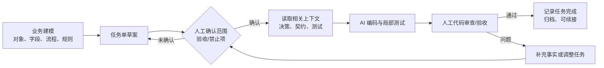

# AI Coding Harness 与 Context Engineering 讲述卡

> **一句话定位**：最小 AI Coding Harness 不是另一个自动写代码的 Agent，而是为 Claude Code / Codex 等 AI 编程工具准备的受控开发上下文与人工审批流程。

---

## 一、90 秒口述答案

> 我在企业 Agent MVP 的开发中沉淀了一个最小 AI Coding Harness。它关注的不是让模型拿到一句需求就直接改完整个仓库，而是先把能够约束研发质量的上下文结构化：例如 `dev_tasks` 定义任务目标、范围、验收和禁止修改项，`decision_log` 记录已确认的架构决策，`api_contract` 固定接口输入输出与兼容边界，`test_plan` 说明需要覆盖的正常、边界和降级场景。实际流程是先做业务建模和任务单人工确认，再由 AI 在限定文件和约束下编码与测试，之后由人审验收，最后把任务记录和决策归档，方便下一次续接。它和成果评审 Agent 的关系是：Harness 在开发前和开发中控制上下文与变更边界，评审 Agent 在开发后基于固定仓库快照和证据链生成评审草稿。两者都要求信息不足时继续检索或交给人工，而不是让模型补全猜测。

## 二、Harness 的最小组成

| 上下文资产 | 回答的问题 | 缺失时的风险 |
| --- | --- | --- |
| `AGENTS.md` / 项目入口说明 | 技术路线、硬约束、禁止项是什么？ | AI 重新选型、绕过既有边界 |
| `docs/architecture.md` | 模块职责、分层、数据流是什么？ | 修改落到错误层次或产生耦合 |
| `docs/dev_tasks/` | 这次只做什么、不能做什么、验收如何判断？ | 任务膨胀、误改无关模块 |
| `docs/decision_log.md` | 哪些取舍已经由人确认？为什么？ | 反复争论或推翻已确认决策 |
| `docs/api_contract.md` | 接口字段、兼容性和错误语义是什么？ | 前后端/调用方不兼容 |
| `docs/test_plan.md` | 如何验证主路径、边界和降级？ | 只生成代码，不验证行为 |

## 三、受控开发闭环

### 人工确认点为什么不可省略

- **开始前**：业务字段、阈值、权限和改动范围不明时，模型不能擅自设定。
- **开发后**：测试通过不代表业务规则、用户体验和责任边界都正确；人审负责最终接受变更。
- **归档前**：把已完成内容、未完成项与待确认项写清，避免下次会话把临时假设当成既有事实。

## 四、什么是足够的任务上下文

### 不是“把整个仓库塞给模型”

Repo 级任务的有效上下文应满足：模型知道**改什么、为什么这样改、不能碰什么、谁依赖它、怎样验证**。这不等于上下文越多越好。

把整个仓库、全部历史对话和所有文档塞进 prompt 的问题是：成本和噪声上升，关键约束被淹没，旧版本事实会与新代码混杂，还会扩大敏感源码暴露范围。

### 一个实用的选择顺序

1. **固定任务边界与版本**：确认任务单、当前分支/提交、允许修改的模块和验收目标。
2. **先加载稳定约束**：项目规则、架构、已确认决策、接口契约和测试计划。
3. **再检索最相关代码证据**：入口、调用链、数据模型、现有测试与相邻实现，而非全仓库扫描后盲猜。
4. **按需补充**：遇到字段、规则或接口语义不明时继续查文档/代码，不用模型常识补全。
5. **信息仍不足时升级给人**：记录待确认项，停止越权实现或把不确定字段写死。

## 五、Harness 与成果评审 Agent：关联与边界

| 维度 | AI Coding Harness | 成果评审 Agent |
| --- | --- | --- |
| 所处阶段 | 开发前、开发中、交付前 | 开发成果形成后 |
| 主要输入 | 任务单、决策、契约、测试计划、相关代码 | checklist、固定仓库快照、仓库事实、候选证据 |
| 主要目标 | 让 AI 在正确上下文和边界内完成变更 | 让评审草稿可定位、可复查、可人工确认 |
| 关键控制 | 任务确认、范围控制、测试、人工验收 | SHA 固定、证据校验、状态机、人工确认 |
| 不做什么 | 不让 AI 越权决定业务规则或自行归档 | 不写 GitLab、不自动发布最终合规结论 |

### 30 秒关联回答

> Harness 解决“AI 如何在已有工程里安全地做开发”，评审 Agent 解决“AI 如何对已有成果给出可信的评审草稿”。前者把任务、决策、接口和测试作为开发上下文，后者把快照、证据和人工确认作为评审上下文。共同原则是：模型可以加速理解、生成和归纳，但关键事实、边界和最终责任必须由结构化约束、测试和人来兜底。

## 六、典型场景回答

### 场景：只收到一句“新增一个评审状态”

> 我不会直接让 AI 搜索后修改。先确认状态的业务定义、允许迁移、接口返回、数据库迁移、前端展示和取消/重试的影响；再读取任务单、状态机相关代码、接口契约和相邻测试。如果状态枚举和迁移规则没有业务确认，就把它作为待确认项，而不是自行新增一个看似合理的状态。确定后再让 AI 在限定范围内实现，并补齐状态迁移和接口回归测试。

### 场景：AI 说“测试通过，可以合并”

> 测试是必要证据，不是自动合并授权。还要由人检查任务范围是否偏移、接口是否兼容、异常分支是否覆盖、数据和安全边界是否满足。Harness 的价值就是把这些人工责任点前置并记录下来，而不是把“代码能运行”误当成“交付可接受”。

## 七、常见错误表达

- 不说“我做了一个让 Claude Code 自动开发的框架”，应说“我沉淀了受控 AI 开发上下文和人工审批闭环”。
- 不说“给模型完整代码就能解决上下文问题”，应说“先固定边界，再按任务选择高价值上下文与代码证据”。
- 不说“测试通过就能自动交付”，应说“测试、代码审查和业务验收共同构成交付证据”。
- 不把 Harness 说成评审 Agent 的功能模块；它们有关联但职责、输入和控制点不同。
