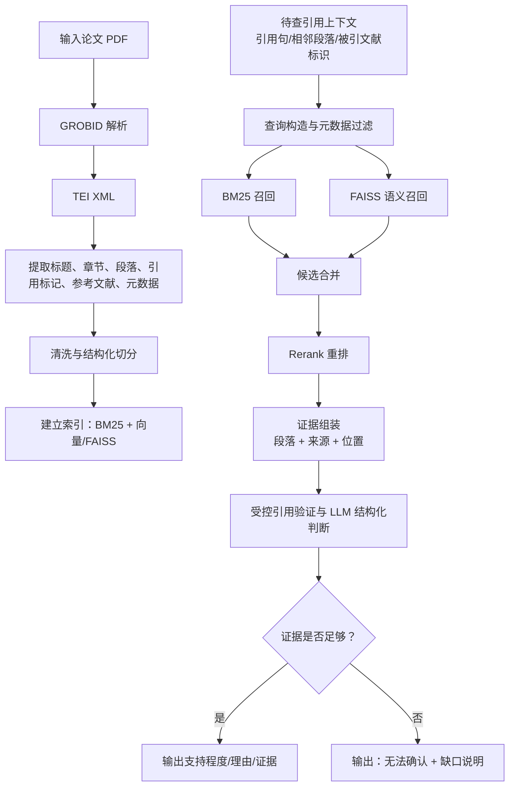

# 项目卡：论文引用查证 Agent + RAG

> **项目一句话**：一个基于 LLM 的论文引用查证系统，将论文 PDF 转为可检索的结构化文本，以 Hybrid RAG 找到与引用主张相关的证据，再输出带证据与“无法确认”降级的结构化判断。

---

## 一、1 分钟项目介绍

> 我做过一个论文引用查证智能体，目标是辅助判断论文中的引用是否有足够的原始文献证据支持。它不是让大模型直接读整篇 PDF 后凭印象判断，而是先用 GROBID 把 PDF 解析为带章节、段落、参考文献等结构的 TEI XML，再按论文结构和引用上下文切分文本并建立索引。检索阶段采用 BM25、FAISS 和 Rerank 组成 Hybrid RAG：BM25 补充术语和精确关键词匹配，向量检索召回语义相近段落，Rerank 在候选中挑选真正与当前引用主张相关的证据。最后把引用上下文、检索证据和来源元数据交给受控验证逻辑与 LLM，输出结构化判断。评测上使用人工标注集，分别看 Recall@k、证据覆盖率和判定准确率；工程上通过 FastAPI 提供接口，结合 Redis、Docker、日志和异常处理。最重要的边界是：证据不足时返回“无法确认”，而不是把检索不到误判为引用不合理。

## 二、从 PDF 到判定的完整链路

### 白板口述顺序

1. **先把 PDF 变成结构化、可定位的文本**，否则后续检索和引用无法可靠追溯。
2. **再用 Hybrid RAG 找候选证据**，不要要求模型记住整篇论文。
3. **最后基于证据做结构化判断**，而不是把“检索分数”直接当结论。
4. **证据不够就显式降级**，避免把模型推测包装成事实。

## 三、关键技术取舍

### 1. 为什么用 GROBID 和 TEI XML

> 学术 PDF 的双栏排版、页眉页脚、公式、参考文献和章节结构会让直接抽纯文本的结果混乱。GROBID 面向学术论文解析，输出 TEI XML 这类结构化表示，可以保留标题、摘要、章节层级、段落、参考文献条目和部分引用关联信息。这样切分时能知道文本位于哪个章节，检索结果也能带来源和位置。代价是解析可能失败或结构不完整，因此需要保留解析状态、异常处理和降级路径。

### 2. chunk 如何设计

**推荐口述**：

> chunk 不宜按固定字符数机械切分。我会优先以段落和章节边界为基础，并把当前引用句或相邻上下文作为检索 query 的一部分；chunk 需要带论文标识、章节、段落位置、引用标记等元数据。chunk 过大时主题混杂、召回不精确且上下文成本高；过小时语义不完整，可能丢掉限定条件、实验设定或结论与证据之间的关系。具体长度和重叠参数应通过标注集验证，不在没有实验记录时虚构数值。

### 3. 元数据过滤解决什么

| 元数据示例 | 作用 |
| --- | --- |
| 论文 ID / 文献标识 | 优先检索当前被引论文或限定候选范围 |
| 标题、作者、年份 | 消除同名或相似文献歧义 |
| 章节、段落位置 | 方便来源展示与后续证据定位 |
| 引用标记、参考文献条目 | 将引用上下文和目标文献关联 |
| 解析状态、文本类型 | 避免把不完整或无效内容当充分证据 |

### 4. BM25、FAISS、Rerank 的分工

| 组件 | 主要解决什么 | 局限 |
| --- | --- | --- |
| BM25 | 专有名词、公式术语、作者名、精确关键词匹配 | 不擅长同义改写和跨表述语义 |
| FAISS 向量检索 | 语义相近但词面不同的段落召回 | 可能召回主题相近但不支持当前主张的内容 |
| Rerank | 用更强的 query-document 相关性判断精选候选 | 增加时延和成本，不能弥补完全没召回到的证据 |

### 为什么 Hybrid RAG 更稳

> 学术引用既有术语精确匹配，也有同义改写和概念归纳。只用 BM25 容易漏掉表达变化，只用向量检索可能把主题相近误当作主张支持。双路召回提高候选覆盖，再用 Rerank 精排，通常比单路检索更稳；代价是索引、融合、调参和评测都更复杂。

## 四、证据驱动的结构化判断

### 输出应该包含什么

- 当前引用主张或引用上下文。
- 被检索的证据片段及其论文/章节/段落来源。
- 判断结果：支持、部分支持、证据不足或无法确认等项目定义的结构化类别；具体枚举以实际 schema 为准。
- 判断理由和限制说明。

### 为什么不让模型直接判定整篇论文

> 整篇论文往往超出有效上下文，也会让模型难以区分原文事实、方法限制和自己的推测。更重要的是，直接结论无法让使用者复查。将模型约束在引用上下文和可定位证据上，可以把它的职责限定为比较、解释和结构化归纳。

### 证据不足的具体例子

> 例如引用句声称“某方法在特定数据集上显著优于基线”，但目标论文的可解析文本里只检索到方法描述，没有对应实验结果、数据集或比较结论。此时不能因为模型“觉得合理”就判定支持，也不能因为没找到就直接说引用错误；应返回“无法确认”，说明缺少可定位的实验结果证据，并提示人工查看表格、附录或原始 PDF。

## 五、评测指标：分别衡量哪一层

| 指标 | 要回答的问题 | 示例解释 |
| --- | --- | --- |
| `Recall@k` | 正确证据是否进入前 k 个候选？ | 如果正确段落不在候选集，后面的 Rerank 和判定都无从谈起。 |
| 证据覆盖率 | 系统最终给出的证据是否覆盖人工认定的关键支持信息？ | 召回到相关段落不等于给出的证据足以支撑主张。 |
| 判定准确率 | 最终支持/不支持/无法确认等判断是否与人工标注一致？ | 检索正确也可能因模型解释错误而判错。 |

### 重要关系

> `Recall@k` 偏检索候选层，证据覆盖率偏最终证据充分性，判定准确率偏端到端结论。三者不能互相替代：高 Recall 不保证模型引用了正确证据，高证据覆盖也不保证分类逻辑正确。

## 六、工程化与异常降级

| 环节 | 作用 | 面试边界 |
| --- | --- | --- |
| FastAPI | 提供上传/查证/结果查询等服务接口，组织请求校验与异常返回 | 不虚构具体 API 路由或并发数据 |
| Redis | 缓存可复用且版本稳定的解析/检索结果，减少重复计算 | 缓存 key、TTL、失效策略需以实现为准 |
| Docker | 统一 GROBID、依赖和服务运行环境，降低环境差异 | 不宣称生产集群规模 |
| 日志 | 记录任务阶段、解析/检索异常和可定位错误信息 | 不记录不必要的敏感全文 |
| 异常降级 | 解析失败、无参考文献、证据不足时返回明确状态和原因 | 不把失败伪装为确定结论 |

## 七、常见错误表达

- 不说“系统能自动判断所有引用是否正确”，应说“对有充分证据的引用给出结构化辅助判断，证据不足时返回无法确认”。
- 不说“FAISS 比 BM25 更先进所以替代 BM25”，应说“两者解决不同召回失败模式，Hybrid RAG 用融合与重排平衡覆盖和精度”。
- 不说“Recall@k 高就说明系统准确”，应区分候选召回、证据覆盖和最终判定。
- 不说未核实的 chunk 参数、模型名称、准确率、缓存策略或线上规模。
