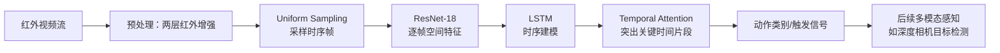

# 项目卡：红外动作触发识别

> **项目一句话**：面向卫星货舱等封闭、复杂光照环境的物资管理需求，构建基于红外视频的动作触发识别方法，为后续多模态感知提供稳定触发信号。

---

## 一、2 分钟项目介绍

> 这个课题面向卫星货舱等封闭、复杂光照环境下的物资管理需求。整体目标是用交互式感知支持后续货物管理，其中我目前完成的是基于红外视频的动作触发识别，为后续深度相机目标检测等多模态感知提供稳定触发信号。数据使用 NTU RGB-D，在官方 Cross-Subject 协议下完成数据划分、训练和评估。模型采用 ResNet-18 加 LSTM 的非 Transformer 基线：ResNet-18 负责从每帧红外图像提取空间视觉特征，LSTM 建模动作随时间变化的序列关系。在此基础上，我针对红外视频设计两层红外增强、Uniform Sampling 和轻量 Temporal Attention：增强提高红外模态的适应性，均匀采样覆盖更完整的关键动作片段，时间注意力让模型更关注对动作判别有贡献的时序位置。实验上，均匀采样方案在 Cross-Subject 协议下达到 96.55% Accuracy 和 0.9934 AUC；综合配置达到 0.9424 F1。这里要注意这些数值来自不同配置和指标，不能简单比较为谁“更好”，而应结合类别不平衡、误检漏检代价和实验设置理解。相关论文已被《计算机应用研究》录用，我是第一作者。

## 二、任务与系统位置



### 为什么是“动作触发”而非完整多模态系统

> 当前已完成的是红外视频动作触发识别，用稳定触发信号告诉后续模块“何时值得进一步感知或处理”。这能减少后续模块持续运行的无效开销，并为复杂环境下的交互提供时机信息；深度相机目标检测是整体方案的一部分，不能说当前已经完成了完整多模态闭环。

## 三、数据与实验协议

### 1. NTU RGB-D

> NTU RGB-D 是常用人体动作识别数据集。当前简历确认基于该数据集完成了数据划分、训练与评估流程设计；具体使用类别、样本数量、红外模拟/转换细节需以实验记录核对。

### 2. 为什么使用 Cross-Subject

> Cross-Subject 按主体划分训练和测试，确保测试者身份没有出现在训练集中。它检验模型是否学到了可泛化的动作模式，而不是记住某些人的体型、动作习惯或采集特征。对于需要面向不同操作人员工作的触发系统，这比随机打散样本更能反映跨主体泛化能力。

### 追问：它的代价是什么？

> 难度更高，结果通常不能和随机划分直接比较；训练集与测试集主体差异会带来性能下降，但这种下降是更贴近真实泛化挑战的信息。

## 四、模型与三项设计

### 1. ResNet-18 + LSTM 的职责分工

| 模块 | 负责什么 | 为什么适合当前基线 |
| --- | --- | --- |
| ResNet-18 | 提取单帧空间特征，如姿态轮廓、局部形状与红外视觉模式 | 结构成熟、相对轻量，适合建立非 Transformer 的视觉基线 |
| LSTM | 建模帧序列中的时间依赖与动作演化 | 动作不是单帧静态图像，需要利用顺序信息 |
| 分类/触发头 | 将时序表征转为类别或触发结果 | 输出服务于后续感知流程 |

### 2. 两层红外增强

> 红外视频与常见 RGB 视觉存在模态差异，目标可能受热分布、对比度和复杂光照影响。两层红外增强的设计动机是提高红外模态适应性，让后续空间特征提取更容易关注动作轮廓与有效差异。具体增强算子、参数和消融结果需以实验代码/论文记录为准，不在面试中补造。

### 3. Uniform Sampling

> 视频长度和动作速度可能不同，如果只取连续前几帧或固定局部片段，容易漏掉动作关键阶段。Uniform Sampling 在整个时间范围均匀选帧，使序列覆盖起始、发展和结束阶段，提升关键动作片段覆盖。它的代价是可能错过非常短暂的瞬时变化，因此采样数和策略应通过实验验证。

### 4. 轻量 Temporal Attention

> LSTM 输出的不同时间步对最终动作判别贡献不一定相同。Temporal Attention 为时间步分配权重，使模型更重视关键片段、弱化无关或冗余帧。使用轻量设计是为了在表达能力与计算开销之间平衡；是否优于其他注意力方案需在相同协议和指标下比较。

## 五、指标：Accuracy、AUC、F1 怎么讲

| 指标 | 含义 | 适合回答什么 |
| --- | --- | --- |
| Accuracy | 正确分类样本占比 | 类别较均衡、错误代价相近时的整体正确率 |
| AUC | ROC 曲线下面积，反映不同阈值下区分正负类的排序能力 | 关注阈值变化或类别不平衡时的区分能力 |
| F1 | Precision 和 Recall 的调和平均 | 同时关心误检与漏检，且正类触发质量重要时 |

### 为什么 96.55% Accuracy、0.9934 AUC 与 0.9424 F1 不能直接比较

> 它们来自不同实验配置，衡量维度也不同：Accuracy 看整体正确比例，AUC 看跨阈值区分能力，F1 平衡 Precision 与 Recall。综合配置的 F1 不是与均匀采样配置的 Accuracy 做大小比较，而是说明在对应设置与目标下对误检、漏检取得了更均衡的表现。正确比较需要固定数据协议、类别定义、阈值和实验配置，再看同一指标。

## 六、训练与评估闭环

```text
任务定义/标签 → Cross-Subject 划分 → 训练基线
        ↓
红外增强 / 采样 / 时间注意力等改动
        ↓
固定协议下评估 Accuracy、AUC、F1
        ↓
分析误检/漏检、类别差异、触发延迟（若有记录）
        ↓
提出下一轮假设并在同一协议验证
```

### 面试安全回答

> 当前简历确认了基线、三项设计、Cross-Subject 协议和列出的指标。我会基于这些讲设计动机和评估逻辑；没有实验记录的超参数、混淆矩阵、具体类别表现、训练轮数或硬件环境，不会临场虚构。

## 七、替代方案与边界

| 方案 | 可能优势 | 当前回答边界 |
| --- | --- | --- |
| 3D CNN | 联合建模时空信息 | 计算量和训练需求可能更高，未作为当前已实现方案 |
| Transformer 时序模型 | 长序列全局建模能力 | 当前基线明确为非 Transformer，不说已对比或更优 |
| 光流/骨架特征 | 显式运动或姿态表示 | 需看传感器和数据质量，未确认当前实现 |
| 完整多模态融合 | 可结合红外与深度信息 | 当前完成的是红外触发识别，后续多模态属于整体方案 |

## 八、常见错误表达

- 不说“我完成了完整多模态感知系统”，应说“完成红外动作触发识别，为后续多模态感知提供触发信号”。
- 不把不同配置下的 Accuracy、AUC、F1 直接比大小。
- 不说“Cross-Subject 保证真实线上泛化”，应说“它更严格地评估跨主体泛化”。
- 不补造增强方法细节、训练超参、设备、样本数或消融结论。
